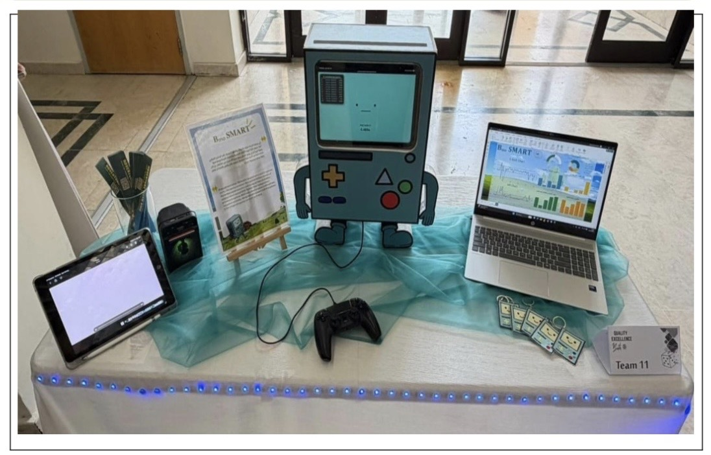
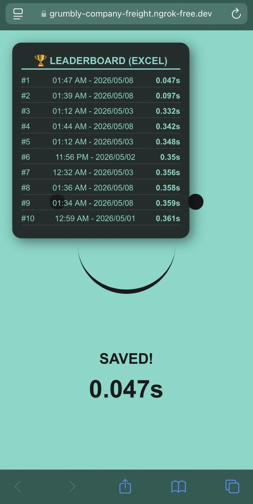
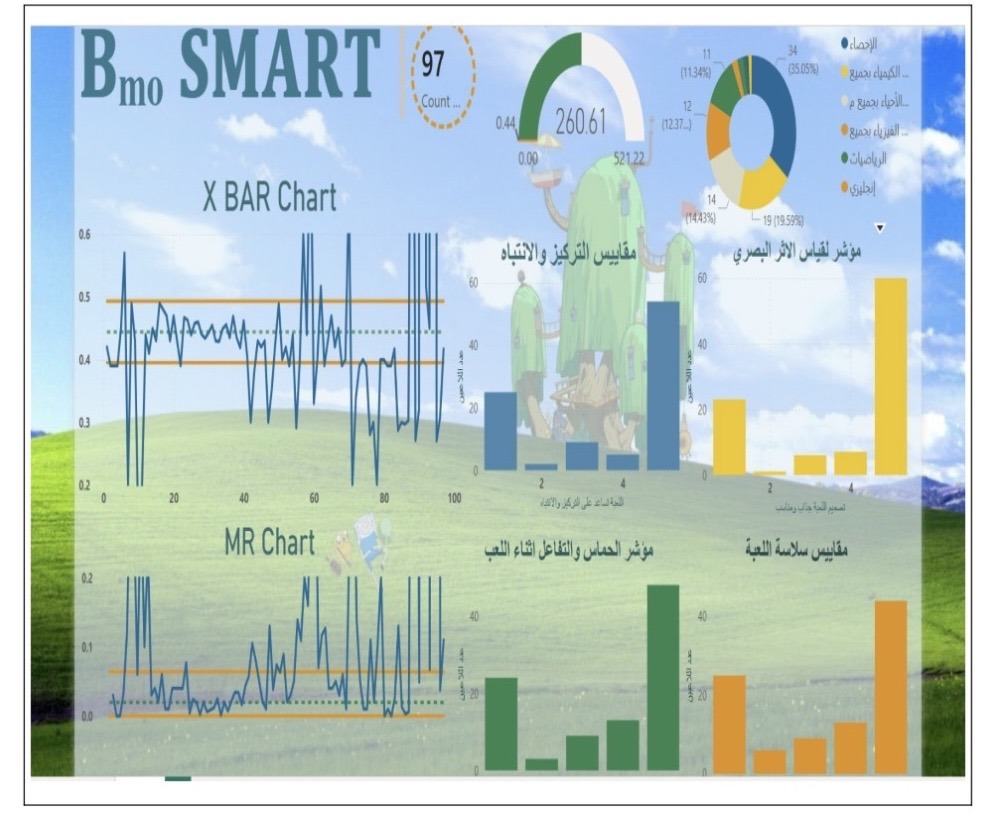
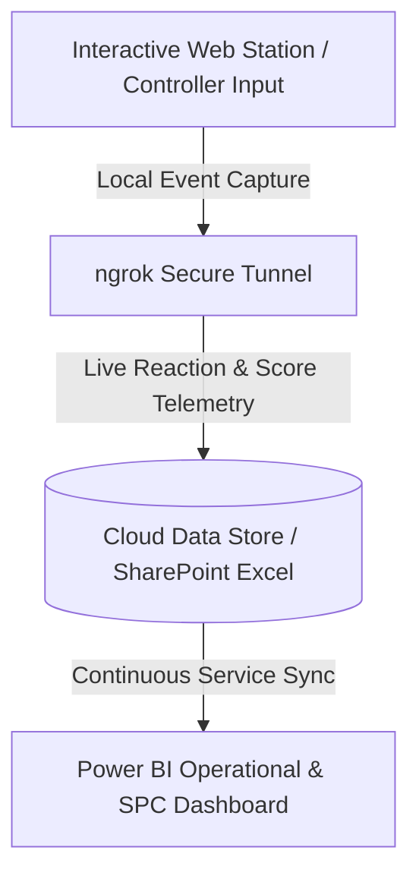

# 🎮 Real-Time Interactive Analytics & Statistical Process Control (SPC) Pipeline

An end-to-end telemetry and monitoring system capturing live user performance from an interactive exhibition station into a cloud data pipeline, streaming live operational metrics into a Power BI dashboard equipped with **Statistical Process Control (SPC)** charts (X-bar & MR Charts).

---

## 📸 Project Showcase & Deployment

| 1. Physical Booth & Console Setup | 2. Live Game & ngrok Leaderboard |
| :---: | :---: |
|  |  |
| *Custom interactive booth with game station & live laptop monitor* | *Web game deployed via ngrok reverse tunnel with cloud Excel sync* |

### 3. Real-Time SPC Quality Control Dashboard

*Live Power BI dashboard computing dynamic Upper/Lower Control Limits (X-bar and Moving Range charts) alongside user engagement KPIs.*

---

## 🚀 System Architecture



## 📂 Repository Structure
```text
├── src/
│   ├── app.py                 # Game logic & event listeners
│   └── data_logger.py         # Cloud sync & telemetry ingestion
├── dashboard/
│   └── spc_analytics.pbix     # Power BI report & DAX measures
├── images/
│   ├── booth_setup.jpg        # Physical installation photo
│   ├── game_interface.png     # Web interface & leaderboard capture
│   └── dashboard_spc.png      # Power BI SPC monitoring view
└── README.md
```

